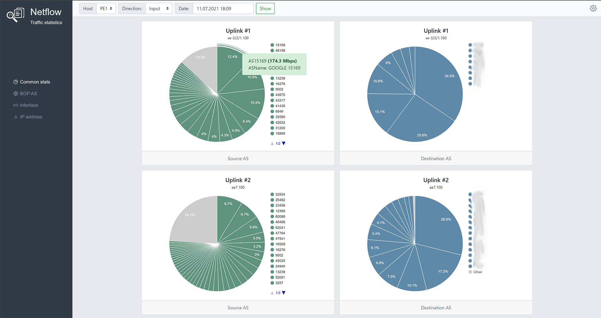
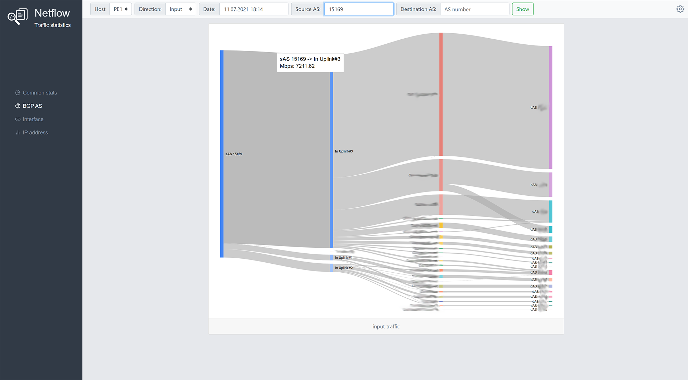

# NFStats
The web-based tool for calculating and displaying network traffic statistics for ISPs.
It uses flow-capture, flow-report, flow-nfilter, flow-print from flow-tools package to analyse NetFlow data and google-charts for display graphs.



### Prerequisites
- FreeBSD or GNU/Linux
- flow-tools
- SNMP Tools
- Python 3.6, Django 3.2 
- One of the Django supported databases:
  - PostgreSQL 9.6 and higher (psycopg2 2.5.4 or higher is required) 
  - MySQL 5.7 and higher.
  - Oracle Database Server versions 12.2 and higher. Version 6.0 or higher of the cx_Oracle Python driver is required. 
  

1. Configure NetFlow v5 on a network device with active timeout 60 sec.
Example for JunOS
```
forwarding-options {
    sampling {
        input {
            rate 2000;
            run-length 0;
        }
        family inet {
            output {
                flow-inactive-timeout 15;
                flow-active-timeout 60; 
                flow-server 10.0.0.10 {
                    port 9999;
                    autonomous-system-type origin;
                    source-address 10.0.0.1;
                    version 5;
                }
            }
        }
    }
}

Add sampling to the uplink interfaces:

ae0 {
...
  unit 0 {
  ...
    family inet {
    ...
      sampling {
         input;
         output;
      }
    }
  }
}

```
2. Install flow-tools on a server.
For the FreeBSD
```
pkg install flow-tools
```
or
```
cd /usr/ports/net-mgmt/flow-tools
make install clean
``` 
for the GNU/Linux build from source (https://code.google.com/archive/p/flow-tools/)

And configure it to start with parameter -n (rotations) equals 1439 (the number of times flow-capture will create a new
file per day. That is, every minute)
Example of FreeBSD rc.conf:
```
flow_capture_enable="YES"
flow_capture_localip="10.0.0.10" 
flow_capture_remoteip="10.0.0.1" 
flow_capture_port="9999" 
flow_capture_datadir="/var/flows" 
flow_capture_flags="-z0 -n1439 -N3 -E10G -e0 -S1"
```
Use 'man flow-capture' to read more about it. 

### Installation
1. Get the repo
```
cd /var/www
git clone https://github.com/owenear/nfstats.git
cd nfstats
python3 -m venv venv
source venv/bin/activate
pip install -r requirements.txt
```
for the Postresql
```
pip install psycopg2-binary
```
2. Create DB (Postgresql example)
```
postgres=# create database nfstats_db;
postgres=# create user nfstats_dbuser with encrypted password 'nfstatsdbpass';
postgres=# grant all ON DATABASE nfstats_db to nfstats_dbuser;
```
3. Create settings.py file
 - copy
```
cd /var/www/nfstats/nfstats/nfstats
cp settings.py.sample settings.py
```
 - make changes to DB options(Postgresql example)
```
DATABASES = {
    'default': {
       'ENGINE': 'django.db.backends.postgresql_psycopg2',
       'NAME': 'nfstats_db',
       'USER' : 'nfstats_dbuser',
       'PASSWORD' : 'nfstatsdbpass',
       'HOST' : 'localhost',
       'PORT' : '5432',
    }
}
```
- make changes to Allowed Hosts
```
ALLOWED_HOSTS = [ 'nfstats.example.com' ]
```
- make changes to TimeZone if you need
```
TIME_ZONE = 'UTC'
```
4. Start Django migrations and create DB schema
 - comment project urls in nfstats/nfstats/nfstats/urls.py
```
urlpatterns = [
    path('admin/', admin.site.urls),
#    path('', include('mainapp.urls')),
]
 ```
 - initiate db
 ```
 cd /var/www/nfstats/nfstats
source ../venv/bin/activate
python manage.py migrate
 ```
 - uncomment project urls in nfstats/nfstats/nfstats/urls.py
 ```
 urlpatterns = [
    path('admin/', admin.site.urls),
    path('', include('mainapp.urls')),
]
 ```
5. Create the log file "/var/log/nfstats.log" and be sure it's writable by the user that’s running the Django application.
 
6. Add NFstats to your Web Server and restart it
 Apache config example, mod-wsgi-py3 is required
```
<VirtualHost *:80>
	ServerName nfstats.example.com
	DocumentRoot /var/www/nfstats
        Alias /static/ /var/www/nfstats/nfstats/static/
        WSGIScriptAlias / /var/www/nfstats/nfstats/nfstats/wsgi.py
        WSGIDaemonProcess nfstats.example.com python-home=/var/www/nfstats/venv python-path=/var/www/nfstats/nfstats
        WSGIProcessGroup nfstats.example.com
</VirtualHost>
```
7. Go to nfstats.example.com, add hosts, interfaces and enjoy!

## Authors

* **Evgeniy Kolosov** - [owenear](https://github.com/owenear)
