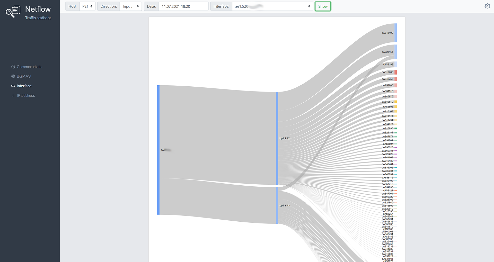
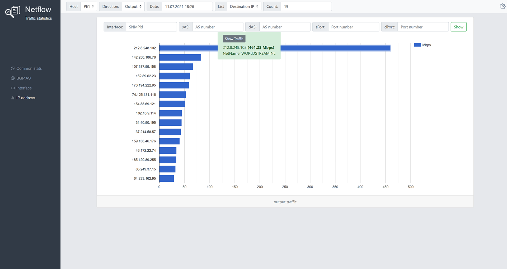

# NFStats
The web-based tool for calculating and displaying network traffic statistics for ISPs.
It uses flow-capture, flow-report, flow-nfilter, flow-print from flow-tools package to analyse NetFlow data and google-charts for display graphs.

<p></p>
<p></p>

## Table of Contents

* [Prerequisites](#prerequisites)
* [Installation](#installation)
* [Usage](#usage)
* [Authors](#authors)
* [License](#license)


## Prerequisites
- FreeBSD or GNU/Linux
- flow-tools (and configured netflow v5 protocol on network devices)
- SNMP Tools (and configured snmp v2c protocol on network devices)
- Python 3.6 and higher (if Ubuntu also python3.6-venv and higher for the virtual enviroment)
- One of the Django supported databases:
  - PostgreSQL 9.6 and higher (psycopg2 2.5.4 or higher is required) 
  - MySQL 5.7 and higher.
  - Oracle Database Server versions 12.2 and higher. Version 6.0 or higher of the cx_Oracle Python driver is required. 
  
See "docs/" in the repo for the help with installation flow-tools.

## Installation

**1. Get the repo and prepare virtual enviroment**
```
cd /var/www
git clone https://github.com/owenear/nfstats.git
cd nfstats
python3 -m venv venv
source venv/bin/activate
pip install -r requirements.txt
```
**2. Install DB engine**
 - if you use Postresql:
```
cd /var/www/nfstats
source venv/bin/activate
pip install psycopg2-binary
```
 - if MySQL and Ubuntu:
```
sudo apt install python3-pip
sudo pip install mysqlclient
cd /var/www/nfstats
source venv/bin/activate
pip install mysqlclient
```
 - if MySQL and FreeBSD:
```
cd /var/www/nfstats
source venv/bin/activate
pip install mysqlclient
```
**3. Create DB**
 - Postgresql
```
postgres=# create database nfstats_db;
postgres=# create user nfstats_dbuser with encrypted password 'nfstatsdbpass';
postgres=# grant all ON DATABASE nfstats_db to nfstats_dbuser;
```
 - MySQL
```
mysql> create database nfstats_db;
mysql> create user 'nfstats_dbuser'@'localhost' IDENTIFIED BY 'nfstatsdbpass';
mysql> GRANT ALL PRIVILEGES ON nfstats_db . * TO 'nfstats_dbuser'@'localhost';
mysql> FLUSH PRIVILEGES;
```
**4. Create settings.py file**
 - copy
```
cd /var/www/nfstats/nfstats/nfstats
cp settings.py.sample settings.py
```
 - make changes to DB options(Postgresql example)
```
DATABASES = {
    'default': {
       'ENGINE': 'django.db.backends.postgresql_psycopg2',
       'NAME': 'nfstats_db',
       'USER' : 'nfstats_dbuser',
       'PASSWORD' : 'nfstatsdbpass',
       'HOST' : 'localhost',
       'PORT' : '5432',
    }
}
```
- make changes to Allowed Hosts
```
ALLOWED_HOSTS = [ 'nfstats.example.com' ]
```
- make changes to TimeZone if you need
```
TIME_ZONE = 'UTC'
```
**5. Start Django migrations and create DB schema**
 - comment project urls in nfstats/nfstats/nfstats/urls.py
```
urlpatterns = [
    path('admin/', admin.site.urls),
#    path('', include('mainapp.urls')),
]
 ```
 - initiate db
 ```
 cd /var/www/nfstats/nfstats
source ../venv/bin/activate
python manage.py migrate
 ```
 - uncomment project urls in nfstats/nfstats/nfstats/urls.py
 ```
 urlpatterns = [
    path('admin/', admin.site.urls),
    path('', include('mainapp.urls')),
]
 ```
**6. Create the log file "/var/log/nfstats.log" and be sure it's writable by the user that’s running the Django application.**
 
**7. Add NFstats to your Web Server and restart it** 
 
Apache with mod-wsgi-py3 config example
```
<VirtualHost *:80>
	ServerName nfstats.example.com
	DocumentRoot /var/www/nfstats
        Alias /static/ /var/www/nfstats/nfstats/static/
        WSGIScriptAlias / /var/www/nfstats/nfstats/nfstats/wsgi.py
        WSGIDaemonProcess nfstats.example.com python-home=/var/www/nfstats/venv python-path=/var/www/nfstats/nfstats
        WSGIProcessGroup nfstats.example.com
</VirtualHost>
```
**8. Put "nfstats/bin/interface_speed.py" script to a cron to execute it every minute**
```
*/1 * * * * /var/www/nfstats/venv/bin/python /www/nfstats/nfstats/bin/interface_speed.py
```

## Usage

## Authors

* **Evgeniy Kolosov** - [owenear](https://github.com/owenear)

## License

NFStats is licensed under the **GPLv3**
