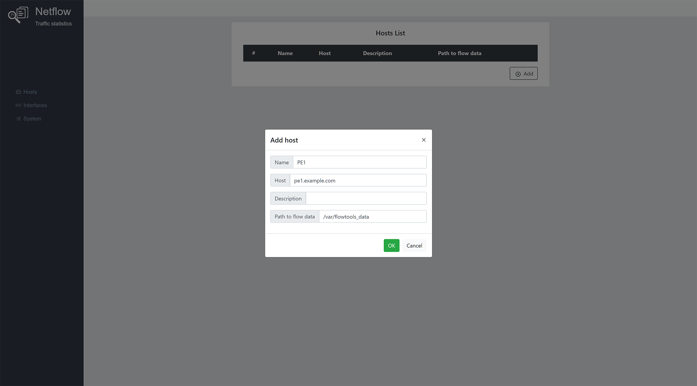
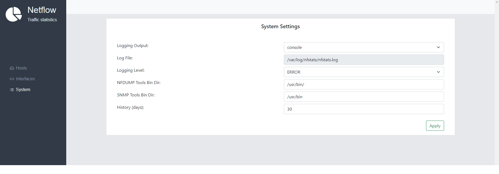
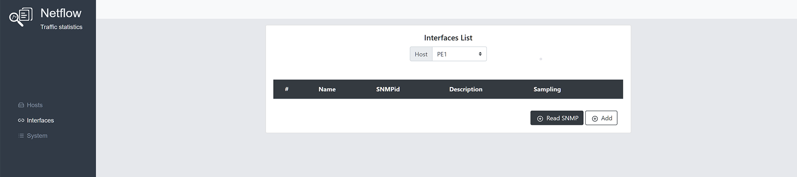
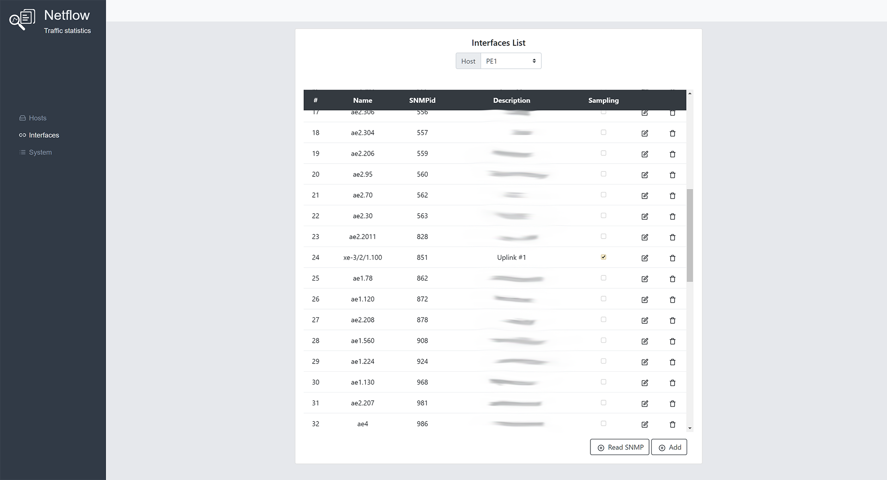
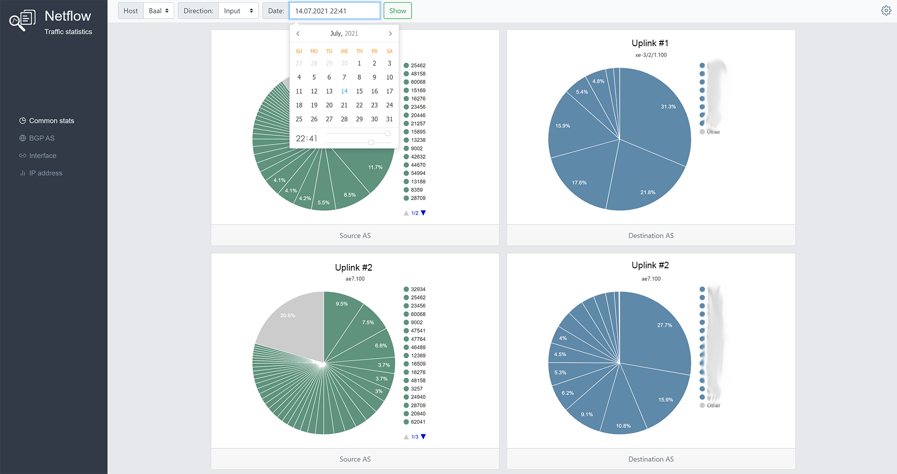

# NFStats
The web-based tool for calculating and displaying network traffic statistics for ISPs.
It can use flow-tools or nfdump utilities to analyse NetFlow data and google-charts for display graphs.

<p></p>
<p></p>

## Change log

### v1.03
* added "Aggregate" functionality on the "Common stats" page
* "History (days)" option now affects the collector files on disk 
* bug fixes

### v1.02
* added NFDUMP support
* bug fixes

### v1.01
* Flow-Tools support
* support multiple hosts
* Common, BGP AS, Interface, IP charts
* Ability to view detailed flow statistics by IP addresses

## Table of Contents

* [Prerequisites](#prerequisites)
* [Installation](#installation)
* [Usage](#usage)
* [Authors](#authors)
* [License](#license)


## Prerequisites
- FreeBSD or GNU/Linux
- flow-tools or nfdump (configure netflow collectors to rotate files every minute. Configure NetFlow (v5/v9/ipfix) on a network device with active timeout 60 sec. See examples in docs)
- SNMP client with snmpget snmpwalk tools (and configured snmp v2c protocol on network devices)
- Python 3.6 and higher (if Ubuntu also python3.6-venv and higher for the virtual enviroment)
- One of the Django supported databases:
  - PostgreSQL 9.6 and higher
  - MySQL 5.7 and higher.
  - Oracle Database Server versions 12.2 and higher. Version 6.0 or higher of the cx_Oracle Python driver is required. 
- Webserver with support Python projects (WSGI)
  
See "docs/" in the repo for the help with installation flow-tools.

## Installation

**1. Get the repo and prepare virtual enviroment**
```
cd /var/www
git clone https://github.com/owenear/nfstats.git
cd nfstats
python3 -m venv venv
source venv/bin/activate
pip install -r requirements.txt
```
**2. Install DB engine**
 - if you use Postresql:
```
cd /var/www/nfstats
source venv/bin/activate
pip install psycopg2-binary
```
 - if MySQL and Ubuntu:
```
sudo apt install python-dev default-libmysqlclient-dev
cd /var/www/nfstats
source venv/bin/activate
pip install mysqlclient
```
 - if MySQL and FreeBSD:
```
cd /var/www/nfstats
source venv/bin/activate
pip install mysqlclient
```
**3. Create DB**
 - Postgresql
```
postgres=# create database nfstats_db;
postgres=# create user nfstats_dbuser with encrypted password 'nfstatsdbpass';
postgres=# grant all ON DATABASE nfstats_db to nfstats_dbuser;
```
 - MySQL
```
mysql> create database nfstats_db;
mysql> create user 'nfstats_dbuser'@'localhost' IDENTIFIED BY 'nfstatsdbpass';
mysql> GRANT ALL PRIVILEGES ON nfstats_db . * TO 'nfstats_dbuser'@'localhost';
mysql> FLUSH PRIVILEGES;
```
**4. Create settings.py file**
 - copy
```
cd /var/www/nfstats/nfstats/nfstats
cp settings.py.sample settings.py
```
 - make changes to DB options(Postgresql example)
```
DATABASES = {
    'default': {
       #'ENGINE': 'django.db.backends.mysql',
       'ENGINE': 'django.db.backends.postgresql_psycopg2',    
       'NAME': 'nfstats_db',
       'USER' : 'nfstats_dbuser',
       'PASSWORD' : 'nfstatsdbpass',
       'HOST' : 'localhost',
       'PORT' : '5432',
    }
}
```
- make changes to Allowed Hosts
```
ALLOWED_HOSTS = [ 'nfstats.example.com' ]
```
- make changes to TimeZone if you need
```
TIME_ZONE = 'UTC'
```
**5. Start Django migrations and create DB schema**
 - comment project urls in nfstats/nfstats/nfstats/urls.py
```
urlpatterns = [
    path('admin/', admin.site.urls),
#    path('', include('mainapp.urls')),
]
 ```
 - initiate db
 ```
 cd /var/www/nfstats/nfstats
source ../venv/bin/activate
python manage.py migrate
 ```
 - uncomment project urls in nfstats/nfstats/nfstats/urls.py
 ```
 urlpatterns = [
    path('admin/', admin.site.urls),
    path('', include('mainapp.urls')),
]
 ```
**6. Create the log file "/var/log/nfstats.log" and be sure it's writable by the user that’s running the Django application.**

**7. Check other permissions:**
  - the "/var/www/nfstats" dir must be writable by the user that’s running the Django application
  - the "/var/www/nfstats/nfstats/flow-tools" dir must be writable by the flow-tools user.
 
**8. Add NFstats to your Web Server and restart it** 
 
Apache with mod-wsgi-py3 config example
```
<VirtualHost *:80>
	ServerName nfstats.example.com
	DocumentRoot /var/www/nfstats
        Alias /static/ /var/www/nfstats/nfstats/static/
        WSGIScriptAlias / /var/www/nfstats/nfstats/nfstats/wsgi.py
        WSGIDaemonProcess nfstats.example.com python-home=/var/www/nfstats/venv python-path=/var/www/nfstats/nfstats
        WSGIProcessGroup nfstats.example.com
</VirtualHost>
```
**9. Put "nfstats/bin/interface_speed.py" script to a cron to execute it every minute**
Script records the interface speed in bps to the DB. This is used for the recalculating the data received from 
netflow collector. So you can use not 1:1 sample rate (sample each packet) on your network devices, but for example 1:2000 packets, 
save the device cpu and get the truthful static data.
```
*/1 * * * * /var/www/nfstats/venv/bin/python /www/nfstats/nfstats/bin/interface_speed.py
```

## Usage

1. When you first open the nfstats.example.com, you will be redirected to the settings page.

On the "Host" tab add the network devices with the configured netflow v5. 
Specify the path to the flow-capture files and be sure it's readable by the user that’s running the Django application. 
<p></p>

2. Go to the "System" tab and select you netflow collector (flow-tools or nfdump), specify SNMP community for the SNMP v2c protocol and other parameters.
"History (days)" - how long the speed data will be stored in the DB and collectors data on a disk. 
It's depends on the flow-capture settings and the amount of data it receives from the devices.

<p></p>

3. Go to the "Interface" tab, click the the "Read SNMP data" and add interface information to the db (Only interfaces with a configured "description" are displayed)

<p></p>

4. Check interfaces with sampling enabled (usually it's uplink interfaces)

<p></p>

5. Finally everything is ready! Open nfstats.example.com and check the stats.

<p></p>

 - "Common Stats" tab: interactive pie charts with the Source/Destination AS stats for the interfaces with sampling enabled.
   Change the Input/Output traffic (relative to the interface) with the "Direction" option.
   You can click on a chart to get the RIPE info about particular AS number. 
 - "BGP AS" tab: interactive sankey chart for the particular AS (source or/and destination) that shows the distribution of traffic by interfaces.
 - "Interface" tab: interactive sankey chart for the interfaces (only interface with NOT sampling enabled is accepted!) that shows the distribution of traffic by AS. 
 - "IP" tab: interactive bar chart with the top IP addresses stats by various parameters. You can click on a chart to get the RIPE info about particular IP address.
    Click the "Show traffic" button to view the extended flows data. 

## Authors

* **Evgeniy Kolosov** - [owenear](https://github.com/owenear)

## License

NFStats is licensed under the **GPLv3**
